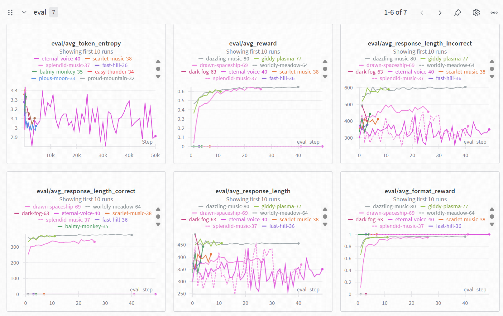
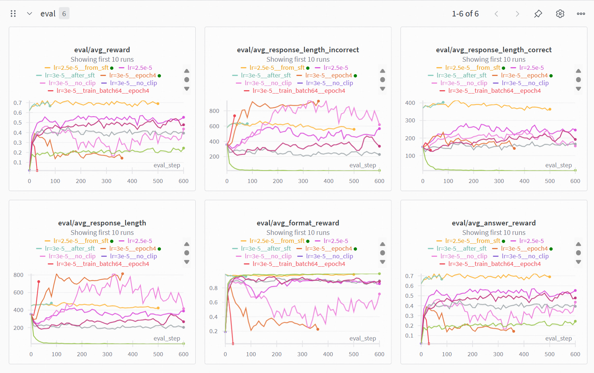

# CS336 Spring 2025 Assignment 5: Alignment

## Datasets available
[Curated train,val,sft (using gpt 4o api with 383 samples) dataset from MATH](./data)
## Overview images
### sft

### RL

## Sft experiments
There isn't much to say about sft. Sft is not very sensitive to learning rate, so a relatively reasonable learning rate would lead to good results. Using the full 383-sample sft dataset will produce a checkpoint with validation accuracy of approximately 0.64.
## RL experiments
See [my wandb report](https://wandb.ai/ltwkevin17-tsinghua-university/cs336-grpo/reports/Ablation-on-RL--VmlldzoxNDA5NDQ1MQ) for detailed reports of the ablation studies.

## Usage
implementations of functions for unit tests in `cs336_alignment/post_training_utils`  
run sft with `uv run cs336_alignment/sft.py`  
run grpo with `uv run cs336_alignment/grpo.py` 

## Link to a repository that helps me a lot
[brandon-snider's github repository](https://github.com/brandon-snider/cs336-a5)


# Original README content
For a full description of the assignment, see the assignment handout at
[cs336_spring2025_assignment5_alignment.pdf](./cs336_spring2025_assignment5_alignment.pdf)

We include a supplemental (and completely optional) assignment on safety alignment, instruction tuning, and RLHF at [cs336_spring2025_assignment5_supplement_safety_rlhf.pdf](./cs336_spring2025_assignment5_supplement_safety_rlhf.pdf)

If you see any issues with the assignment handout or code, please feel free to
raise a GitHub issue or open a pull request with a fix.

## Setup

As in previous assignments, we use `uv` to manage dependencies.

1. Install all packages except `flash-attn`, then all packages (`flash-attn` is weird)
```
uv sync --no-install-package flash-attn
uv sync
```

2. Run unit tests:

``` sh
uv run pytest
```

Initially, all tests should fail with `NotImplementedError`s.
To connect your implementation to the tests, complete the
functions in [./tests/adapters.py](./tests/adapters.py).

